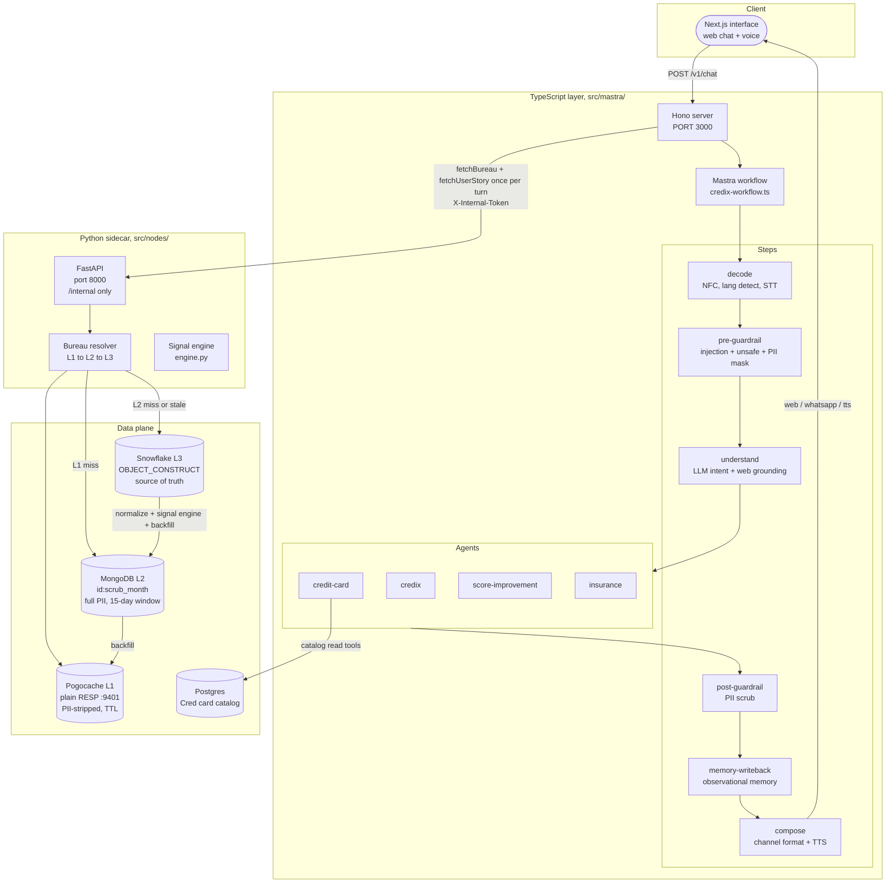
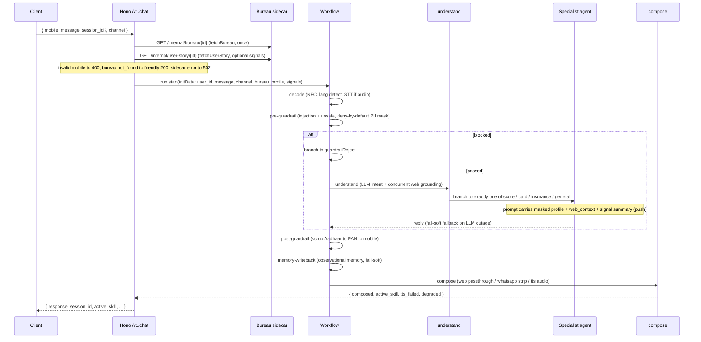
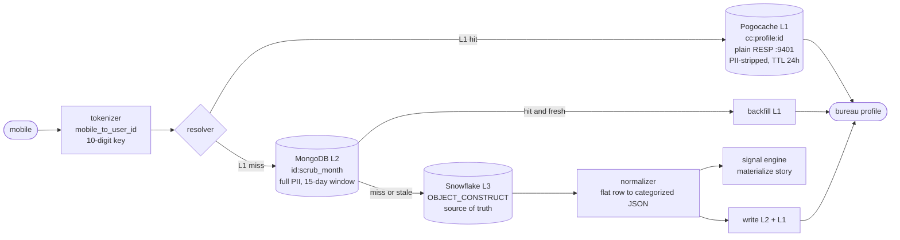

#  Credix

Project workflow and agent conventions are in [SETUP.md](SETUP.md); read it before starting work.

> **Rahul** is an AI credit-coaching credix for the Indian retail credit market. **FRIDAY v1** is
> the name of the runtime that ships it.

A deterministic-routed multi-agent system. A TypeScript / Mastra orchestration layer (behind a Hono
HTTP server) drives the conversation and business logic; a Python / FastAPI sidecar owns the data
plane (Pogocache to MongoDB to Snowflake) and the bureau signal engine. The agent never sees raw
PII, and every number it states traces back to a tool output or a precomputed signal.

---

## Status

| Layer | State | Notes |
|---|---|---|
| Bureau data plane (L1 Pogocache, L2 Mongo, L3 Snowflake) | shipped | plain RESP cache, read-through resolver |
| Bureau signal engine (62 Tier-1 + 34 Tier-2 + compose) | shipped | computed server-side at materialize time |
| Hono server + Mastra workflow | shipped | `POST /v1/chat`, `POST /v1/statement`, `GET /health` |
| Deterministic steps + 4 specialist agents | shipped | decode, guardrails, understand, compose |
| Observability (OpenTelemetry to Honeycomb) | shipped | PII-safe custom spans, capture-IO opt-in |
| Next.js interface (assistant-ui) | shipped | non-streaming request/response chat + voice |
| Cred credit-card catalog tools (Issue 006, ZT-597) | Phase A shipped | 6 read tools on `creditCardAgent`; math/recommendation phases pending |

FRIDAY v1 is tracked under Jira epic ZT-260. Two feature branches are stacked: `feat/bureau-python-wrapper`
(the runtime) and `feat/cred-catalog-tools` (the catalog tools, branched on top).

---

## System architecture



The public API is Hono, not the Mastra dev server. Mastra registers the workflow, the 4 agents, and
the LibSQL store ([`src/mastra/index.ts`](src/mastra/index.ts)); Hono sits in front and owns the
routes ([`src/mastra/server.ts`](src/mastra/server.ts)).

---

## Repository layout

The active FRIDAY v1 runtime is the TypeScript Mastra layer plus a narrow Python bureau sidecar:

```
src/
  mastra/                      TypeScript orchestration (Hono + Mastra)
    server.ts                      Hono: POST /v1/chat, POST /v1/statement, GET /health
    index.ts                       Mastra instance: storage + agents + workflow
    workflows/
      credix-workflow.ts           The ordered pipeline (decode to compose) + branch routing
    steps/
      decode.ts                    NFC normalize, script-based lang detect, ElevenLabs STT
      pre-guardrail.ts             Injection + unsafe filters, deny-by-default PII mask
      understand.ts                LLM intent classifier + concurrent web grounding
      post-guardrail.ts            Aadhaar/PAN/mobile scrub of the reply
      memory-writeback.ts          Trigger observational memory (fail-soft)
      compose.ts                   WhatsApp / web / TTS channel formatter
      identity-check.ts            Standalone bureau-record check (NOT in the live chain)
      user-story.ts                Stub (TODO); real signals path is lib + tools/signals
    agents/
      credix.ts                    Rahul root agent (general + bureau queries)
      credit-card.ts               Credit-card specialist (+ 6 Cred catalog tools)
      score-improvement.ts         CIBIL coaching specialist
      insurance.ts                 Insurance specialist (Phase-3 stub)
      persona.ts                   RAHUL_PERSONA (shared instruction string)
    tools/
      bureau.ts                    getBureauDetail (one section), getBureauProfile (unattached)
      signals.ts                   getSignals (precomputed bureau signals, push + pull)
      calculators.ts               calculateEmi, calculateFoir (defined, currently unattached)
      eligibility.ts               checkCardEligibility (pure decision tree)
      statement.ts                 getStatement (uploaded, chunked statement reader)
      exa.ts                       exaSearch (web grounding via Exa)
      card-catalog.ts              6 Cred catalog read tools
    memory/index.ts                credixMemory: working memory + observational memory
    lib/                           provider (Grok), patterns, retry, storage, otel, fetchers,
                                   catalog-db + catalog-cards, signal-summary, statement-store
    tracing.ts                     OpenTelemetry SDK bootstrap (loaded before app code)
    __tests__/                     26 test/QA files (unit, mocked, and live-gated)

  nodes/                           Python data sidecar (FastAPI)
    api/
      app.py                       create_app: mounts ONLY the bureau_internal router
      routes/bureau_internal.py    GET /internal/bureau/{id}[/{section}], /internal/user-story/{id}
    raw_data/bureau/
      resolver.py                  L1 to L2 to L3 read-through, Redis per-user build lock
      factory.py                   Process-global resolver singleton (wires all clients)
      cache_client.py              L1 CacheRepo: plain-RESP key/value (one JSON string per key)
      mongo_client.py              L2 MongoRepo: durable docs keyed {user_id}:{scrub_month}
      snowflake_client.py          L3 fetch_scrub_row: OBJECT_CONSTRUCT join (lazy connect)
      normalizer.py                Flat Snowflake row to categorized doc (scrub_mapping.yaml)
      tokenizer.py                 mobile_to_user_id (bare 10-digit canonical key)
      pii.py                       strip_secure (drops config-flagged secure sections)
      partial_reads.py             VALID_SECTIONS + select_section
      client.py                    Async facade get_bureau_profile / get_bureau_section
    raw_data/user_story/
      engine.py                    Bureau signal engine (62 Tier-1 + 34 Tier-2 + compose)
      signals.py                   compute_signals (structural + run_engine); SIGNALS_VERSION
      store.py                     UserStoryStore.materialize / get (L1 + L2)

config/                            settings.py (load_env), scrub_mapping.yaml (normalizer map)
tests/                             Python unit (10 files) + integration (2 files)
interface/                         Next.js 16 app (assistant-ui chat + voice)
docs/                              Architecture, ADRs, personas, integration plans
tasks/                             todo.md, progress.md, lessons.md, findings.md
```

Note: `src/nodes/` also contains a larger earlier scaffold (`graph/`, `guardrails/`, `llm/`,
`persona/`, `memory/`, `tools/`, `workers/`, `observability/`, and several `raw_data/` subtrees).
That was an initial Python-native design and is **not wired into the FRIDAY v1 runtime**:
[`app.py`](src/nodes/api/app.py) mounts only the bureau sidecar router. Guardrails, LLM routing,
persona, and memory all live in the TypeScript layer in the running system.

---

## Request pipeline

Each `POST /v1/chat` turn runs the workflow steps in order. Identity resolution and the bureau /
signals fetches happen once in Hono, before the workflow, then thread into the run as `initData`.



Details worth knowing:

- **`decode`** ([`steps/decode.ts`](src/mastra/steps/decode.ts)) runs ElevenLabs Scribe
  (`scribe_v2`) when an `audio_url` is present, else detects language from Unicode script ranges
  (Devanagari, Gujarati, Bengali, Tamil, else English).
- **`pre-guardrail`** ([`steps/pre-guardrail.ts`](src/mastra/steps/pre-guardrail.ts)) checks
  `INJECTION_PATTERNS` then `UNSAFE_PATTERNS`, then masks the profile **deny-by-default**: it builds
  a fresh object, partially masks user_id / mobile / PAN / Aadhaar, allowlists only `credit_score`
  from `general_info`, and forwards the safe sections whole. It does not fetch; it reads the
  pre-fetched profile from `initData`.
- **`understand`** ([`steps/understand.ts`](src/mastra/steps/understand.ts)) uses a stateless Grok
  classifier with a structured `{ intent }` output and an `errorStrategy` fallback to `general`. Web
  grounding runs concurrently and is discarded for `bureau_query`.
- **Branch routing** ([`credix-workflow.ts`](src/mastra/workflows/credix-workflow.ts)): Mastra
  `.branch()` runs every truthy condition, so the conditions are made mutually exclusive and the
  general branch explicitly excludes the three specialist intents.
- **`post-guardrail`** ([`steps/post-guardrail.ts`](src/mastra/steps/post-guardrail.ts)) rebuilds
  each `/g` regex per call (to reset `lastIndex`) and scrubs Aadhaar before PAN before mobile.
- **`compose`** ([`steps/compose.ts`](src/mastra/steps/compose.ts)) runs ElevenLabs TTS
  (`eleven_flash_v2_5`) for the `tts` channel and returns a base64 data URI; a TTS outage is
  fail-soft (returns the spoken text with `tts_failed: true`, never a 502).

Two step files exist but are not on the live path: [`identity-check.ts`](src/mastra/steps/identity-check.ts)
is a standalone check (identity is done in Hono), and [`user-story.ts`](src/mastra/steps/user-story.ts)
is a stub (the LLM prose render is deferred; the signals path is the fetch lib plus the `getSignals`
tool).

---

## Bureau data layer

A mobile number resolves to a categorized bureau profile through a three-tier read-through cache.



Key invariants (see [`resolver.py`](src/nodes/raw_data/bureau/resolver.py),
[`cache_client.py`](src/nodes/raw_data/bureau/cache_client.py),
[`factory.py`](src/nodes/raw_data/bureau/factory.py)):

- **User key** is the bare 10-digit mobile (`mobile_to_user_id`); no hashing.
- **L1 is plain RESP**, not RedisJSON. The whole PII-stripped profile is stored as one JSON string
  per key and sectioned in Python. The backend is **Pogocache** (default `redis://localhost:9401`),
  and the client forces **RESP2** (`protocol=2`) because Pogocache rejects the RESP3 `HELLO`
  handshake that redis-py sends by default.
- **L2 key** is `{user_id}:{scrub_month}` (for example `9944003361:Oct-2025`); L2 holds full PII.
- **Freshness** is a fixed window: if the Mongo doc is older than `BUREAU_FRESH_DAYS` (default 15),
  the resolver falls through to Snowflake and rebuilds.
- **Concurrency** is controlled by a Redis distributed per-user lock (`cc:lock:{user_id}`, `SET NX EX`,
  30s TTL, 5s wait). It uses seconds (`ex`), not milliseconds, because Pogocache does not support
  `px`. A lock timeout surfaces as a `TimeoutError`.
- The sidecar returns the profile to the TypeScript layer via `GET /internal/bureau/{user_id}`; PII
  is present on that internal call and masked again by `pre-guardrail` before the LLM sees it.

---

## Bureau signal engine

[`engine.py`](src/nodes/raw_data/user_story/engine.py) turns one user's categorized bureau document
into a rich, agent-facing signal set: **62 Tier-1 base variables**, **34 Tier-2 composite signals**,
and a gated, severity-ranked **compose** list. It is a verbatim port of a reference engine, wrapped
with a flat-view adapter (`_to_flat`) that is the deterministic inverse of `scrub_mapping.yaml`.

- **Where it runs:** server-side, at **materialize time** (the write path, off the request hot
  path), while the document still holds PII. This is the only moment the PII-derived signals (exact
  age, income estimates) can be computed with real inputs; only the derived values are persisted.
- **Persistence** ([`store.py`](src/nodes/raw_data/user_story/store.py)): `materialize` stamps
  `_meta.compute_ms`, writes L2 Mongo first then L1 cache (`cc:story:{id}`, TTL `STORY_TTL`), and
  leaves the LLM prose `user_story` as `None` (deferred). `SIGNALS_VERSION` is 2, so a schema change
  forces re-materialization.
- **Serve:** `GET /internal/user-story/{user_id}` reads the store (L1 to L2 read-through, re-warming
  L1) and double-strips with `strip_secure` as defense-in-depth.
- **Fetch:** [`lib/user-story-fetch.ts`](src/mastra/lib/user-story-fetch.ts) mirrors the bureau
  fetcher, with an in-process TTL cache and a PII-safe `user-story.fetch` span.

The agent gets signals two ways:

- **Push (every turn, no tool call):** [`lib/signal-summary.ts`](src/mastra/lib/signal-summary.ts)
  injects a compact PII-safe headline (segment, file tier, life stage, then the top 3 gated compose
  bullets) into the specialist prompt. Exact age and income are not spelled here.
- **Pull (on demand):** the [`getSignals`](src/mastra/tools/signals.ts) tool (on all 4 specialists)
  reads the in-process cache, with optional section narrowing: `tier1` (62 base vars, includes exact
  age and income estimates), `tier2` (34 composite), or `compose` (the ranked list).

Full detail, including the tier variable list and the PII contract, is in
[`docs/architecture/signal-engine.md`](docs/architecture/signal-engine.md).

---

## Agents and tools

Four agents ([`agents/index.ts`](src/mastra/agents/index.ts)), all on the Grok model, all sharing
`credixMemory` and the `RAHUL_PERSONA` instruction ([`persona.ts`](src/mastra/agents/persona.ts):
Rahul answers in 120 words or fewer, numbers as digits with Indian grouping, no PAN / Aadhaar / full
mobile, and works from the masked profile first).

| Agent | Role | Tools |
|---|---|---|
| `credixAgent` | General and bureau-query catch-all; owns the greeting | `getBureauDetail`, `getSignals`, `exaSearch`, `getStatement` |
| `creditCardAgent` | Credit-card specialist | the above plus `checkCardEligibility` and the 6 catalog tools (11 total) |
| `scoreImprovementAgent` | CIBIL score coaching | `getBureauDetail`, `getSignals`, `exaSearch`, `getStatement` |
| `insuranceAgent` | Credit-linked insurance (Phase-3 stub) | `exaSearch`, `getSignals` |

The full bureau profile is deliberately not attached as a tool; the masked profile is injected into
the prompt instead. `calculateEmi` / `calculateFoir` ([`tools/calculators.ts`](src/mastra/tools/calculators.ts))
and `getBureauProfile` are defined but not currently attached to any agent.

### Credit-card catalog (Issue 006 / ZT-597)

The catalog is a **Postgres** data layer, not a JSON file. In this first cut it reuses Cred's
Supabase catalog directly through a lazy `pg` pool ([`lib/catalog-db.ts`](src/mastra/lib/catalog-db.ts)):
`getCatalogPool()` returns `null` when `DATABASE_URL` is unset, so imports never crash and the tools
fail soft with `CATALOG_DB_UNAVAILABLE`. Card-name matching and reward ranking stay in SQL
([`lib/catalog-cards.ts`](src/mastra/lib/catalog-cards.ts)), never reimplemented in TypeScript. Card
data is public, so the catalog spans carry counts only (no PII).

The 6 read tools ([`tools/card-catalog.ts`](src/mastra/tools/card-catalog.ts)):

| Tool | Returns |
|---|---|
| `getCardCriteria` | Eligibility thresholds for one card (income floor by employment type, min score, NTC policy, fee, invite-only flags) |
| `getCardFees` | Full fee breakdown (joining, annual, GST-inclusive totals, waivers, forex markup, interest, cash-advance, late payment) |
| `getCardPartnerRates` | Merchant earn rates; 3 modes: card-only, partner-only (reverse lookup), card plus partner |
| `getCardBenefits` | Lounge access, welcome and milestone benefits, golf, dining, insurance covers, fuel waiver |
| `getCardDetails` | Primary source of truth for one card: row plus fees, per-category earn rates, exclusions, milestones, lounge, transfer partners |
| `compareCards` | Side-by-side of 2 to 3 cards (fees, top earn rates, benefits, lounge, eligibility floors) |

Phase A (these read tools) is complete; the math tools (`getCardEarnRate`, `routeSpend`), the
recommendation / funnel tools, the bureau rewires, and the catalog-hosting decision are the pending
phases. The integration principle, from
[`docs/architecture/cred-credix-integration.md`](docs/architecture/cred-credix-integration.md):
where Cred routes to a different agent, Credix selects a different tool inside the one
`creditCardAgent`; nothing from Cred becomes a new pipeline node.

---

## Memory

One shared `credixMemory` instance ([`memory/index.ts`](src/mastra/memory/index.ts)) on the LibSQL
store, `lastMessages: 20`:

- **Working memory** is `scope: 'resource'` (per user, across sessions) with a Zod schema
  (`goals`, `hard_constraints`, `prose_summary`). Schema mode gives MERGE semantics so a partial
  write preserves other fields. It must not hold PAN / Aadhaar / mobile or raw bureau data.
- **Observational memory** reuses the Grok model (no separate key), `scope: OM_SCOPE` (default
  `thread`, per session), with token thresholds `OM_MESSAGE_TOKENS` (30000) and
  `OM_OBSERVATION_TOKENS` (40000). `memory-writeback` triggers it explicitly (`finalize` then
  `reflect`) because the auto-trigger does not fire on this path.

---

## Observability

OpenTelemetry to Honeycomb (or a local OTel Collector), service name `credix-mastra`. The SDK
boots from [`tracing.ts`](src/mastra/tracing.ts) via `--import` before app code, and degrades
gracefully: if neither `OTEL_EXPORTER_OTLP_ENDPOINT` nor `_HEADERS` is set, tracing is simply
disabled rather than spamming a missing collector.

Custom spans: `credix.workflow`, `agent.generate`, `understand.classify`, `web.grounding`,
`bureau.fetch`, `user-story.fetch`, `signals.lookup`, `om.writeback`, and a `stage.*` span per
deterministic step.

PII rules ([`lib/otel.ts`](src/mastra/lib/otel.ts)):

- Span attributes never carry the mobile / user_id, raw messages, PAN / Aadhaar, or CIBIL scores;
  only intents, skills, channels, counts, durations, and result classifications.
- The auto undici span for the bureau sidecar path (`/internal/bureau/<mobile>`, which embeds the
  mobile) is suppressed; the PII-safe `bureau.fetch` custom span covers the call.
- Optional stage input/output capture (`OTEL_CAPTURE_IO`, off by default) runs every payload through
  an identifier scrubber (PAN / Aadhaar / mobile to `[REDACTED]`) before it can reach a span.

More detail is in [`src/mastra/OBSERVABILITY.md`](src/mastra/OBSERVABILITY.md).

---

## Error handling and reliability

- **`withRetry`** ([`lib/retry.ts`](src/mastra/lib/retry.ts)) wraps the ElevenLabs STT and TTS
  calls: 3 attempts, exponential backoff (500ms, 1s, 2s). It retries 5xx, 429, and network errors,
  and fast-fails other 4xx (401 / 403 / 400 / 402) where retrying is futile.
- **Fail-soft paths:** a specialist LLM outage returns a safe fallback with an `agent_error` marker
  rather than throwing; a TTS outage returns the spoken text with `tts_failed: true`; the bureau /
  signals fetches are non-fatal (a miss still runs the specialist on the masked profile); the signal
  materialize step logs a warning and never breaks bureau serving.
- **HTTP mapping** in Hono: invalid mobile to 400, bureau not-found to a friendly 200
  (`active_skill: 'not_found'`), sidecar error to 502, workflow failure to 502.

---

## Quickstart

The Makefile drives the full local stack.

```bash
# One-time install (editable, with dev + graph extras; the sidecar needs FastAPI from [graph])
make install                  # uv pip install -e ".[graph,dev]"
cp .env.example .env          # fill in Mongo / Snowflake / Grok / secret; see Configuration

# Full stack: Pogocache (:9401) + Python sidecar (:8000) + Mastra/Hono (:3000)
make dev

# Or start pieces individually
make cache-up                 # Pogocache L1 on :9401 (idempotent)
make dev-sidecar              # uvicorn sidecar on :8000
make dev-mastra               # Mastra/Hono on :3000

# Smoke-test the bureau resolver directly
python scripts/resolve_profile.py 9944003361
```

TypeScript layer (from `src/mastra/`):

```bash
bun install
bun run typecheck             # tsc --noEmit, must exit 0
bun run dev                   # Hono with tracing; use dev:untraced to skip the OTel SDK
```

Interface (from `interface/`, Next.js 16 on port 5174):

```bash
npm install                   # or pnpm
npm run dev                   # next dev --turbopack -p 5174
```

Set `CREDIX_API_URL` in `interface/.env.local` to the Hono server (default `http://localhost:3000`).

### Tests

```bash
# Python: 55 unit tests (10 files) + 8 integration (live-gated)
uv run pytest tests/

# TypeScript: 26 files; unit and mocked suites run by default
cd src/mastra && bun test

# Live suites are env-gated and skipped otherwise, for example:
#   LIVE_E2E, LIVE_CATALOG, LIVE_OM, BUREAU_LIVE, POGOCACHE_LIVE
```

---

## Configuration

### Python sidecar

| Variable | Required | Default | Description |
|---|---|---|---|
| `MONGODB_URI` | yes | `""` | L2 audit store connection string |
| `MONGODB_DB` | no | `consumer` | L2 database name |
| `REDIS_URL` | no | `redis://localhost:9401` | L1 Pogocache (plain RESP) URL |
| `REDIS_TTL` | no | `86400` | L1 profile TTL (seconds) |
| `STORY_TTL` | no | `= REDIS_TTL` | L1 signal-story TTL (seconds) |
| `BUREAU_FRESH_DAYS` | no | `15` | Mongo freshness window (days) |
| `SNOWFLAKE_ACCOUNT` / `USER` / `ROLE` / `WAREHOUSE` / `DATABASE` / `SCHEMA` | yes | none | L3 connection |
| `SNOWFLAKE_PAT` / `SNOWFLAKE_PASSWORD` / `SNOWFLAKE_PRIVATE_KEY_FILE` | one of | none | L3 auth (PAT preferred, then password, then key-pair) |
| `INTERNAL_API_SECRET` | yes | `""` | Shared secret for the `/internal/*` routes |

### TypeScript layer

| Variable | Required | Default | Description |
|---|---|---|---|
| `XAI_API_KEY` | yes | `""` | xAI key, the default provider for master, workers, and OM |
| `GEMINI_API_KEY` | if using `google/*` | `""` | Google AI key; forwarded to `GOOGLE_GENERATIVE_AI_API_KEY` |
| `MASTER_MODEL` / `WORKER_MODEL` | no | `xai/grok-4.5` / `xai/grok-4.20-0309-non-reasoning` | Supervisor and worker models; the `provider/model` prefix selects the provider, so switching is an env edit |
| `PORT` | no | `3000` | Hono port (must not be 2024, the Mastra Studio port) |
| `BUREAU_SIDECAR_URL` | yes | `http://localhost:8000` | Python sidecar base URL |
| `INTERNAL_API_SECRET` | yes | `""` | Must match the sidecar's secret |
| `MASTRA_DB_URL` | no | `file:./mastra.db` | LibSQL store path |
| `ELEVENLABS_API_KEY` | for voice | none | STT decode and TTS compose |
| `ELEVENLABS_VOICE_ID` | no | `JBFqnCBsd6RMkjVDRZzb` | TTS voice |
| `EXA_API_KEY` | for grounding | none | Web grounding (fail-soft if absent) |
| `DATABASE_URL` | for catalog | none | Postgres catalog (fail-soft if absent) |
| `DB_SSL_CA` / `DB_SSL_VERIFY` / `DB_SSL_INSECURE` | for catalog TLS | unverified in dev/test | Authenticate catalog TLS: CA path, system CA, or explicitly allow unverified; in production the first catalog query fails unless one is set (the pool is built lazily, so the app still boots and serves non-catalog requests) |
| `OM_SCOPE` / `OM_MESSAGE_TOKENS` / `OM_OBSERVATION_TOKENS` | no | `thread` / `30000` / `40000` | Observational memory tuning |
| `BUREAU_CACHE_TTL_MS` / `USER_STORY_CACHE_TTL_MS` | no | `900000` | In-process fetch caches (0 disables) |
| `OTEL_EXPORTER_OTLP_ENDPOINT` / `_HEADERS` | for tracing | unset | OTLP target; unset disables tracing |
| `OTEL_CAPTURE_IO` | no | off | Opt-in scrubbed stage I/O capture |

### Interface

| Variable | Default | Description |
|---|---|---|
| `CREDIX_API_URL` | `http://localhost:3000` | Hono backend (server-side proxy target) |
| `ELEVENLABS_API_KEY` | none | Voice STT/TTS proxy |
| `ELEVENLABS_STT_MODEL` / `ELEVENLABS_VOICE_ID` / `ELEVENLABS_TTS_MODEL` | model defaults | Voice models |
| `DATALAB_API_KEY` | none | Optional better PDF statement parser (falls back to local unpdf) |

---

## Interface

[`interface/`](interface/) is a Next.js 16 / React 19 app (App Router, Turbopack, Tailwind v4,
Biome), on port 5174. The chat surface uses **assistant-ui** with a `useLocalRuntime` adapter, so a
turn is a single request/response (one `fetch('/api/chat')`, one full text block), **not token
streaming**. It sends `{ mobile, message, session_id, channel: 'web' }` and persists the
backend-issued `session_id` to `localStorage`.

Four Node-runtime API routes proxy same-origin so the browser never calls the backend or third
parties directly:

| Route | Proxies to | Guard |
|---|---|---|
| `/api/chat` | `POST ${CREDIX_API_URL}/v1/chat` | 502 wrapper on backend outage |
| `/api/stt` | ElevenLabs Scribe (`scribe_v2`) | 503 if key missing, 400 on empty audio |
| `/api/tts` | ElevenLabs TTS | 2500-character cap |
| `/api/parse-statement` | datalab.to (or local unpdf), then `POST /v1/statement` | 15 MB cap to 413 |

Voice input, a three.js orb visual, and a phone-number entry screen round out the UI.

---

## Conventions

- **PII boundary:** the agent never sees raw PII. `pre-guardrail` masks the profile deny-by-default;
  `post-guardrail` scrubs the reply. The Python sidecar is the only code that touches full PII, and
  even the signal engine persists derived values only.
- **Numeric output:** all money, scores, and percentages as digits, never spelled out (TTS
  mispronounces spelled numbers).
- **Scrub order:** Aadhaar (12 digits) before mobile (10 digits) so a partial Aadhaar is not matched
  as two mobiles. CIBIL scores are deliberately not redacted (the agent needs to state them).
- **Regex:** never use an exported global `/g` constant directly; rebuild with
  `new RegExp(pattern.source, 'g')` to reset `lastIndex`.
- **Writing:** no dashes as separators anywhere (commit messages, docs, comments); use `;`, `,`, or
  rephrase.
- **TypeScript:** `moduleResolution: "bundler"` is required for Mastra export maps; do not change it.
- **Python:** node functions are `async def` and return a `dict`; no blocking I/O in async code.

---

## Roadmap

| Issue | Scope | State |
|---|---|---|
| 001 | Hono + Mastra bootstrap, Python sidecar hardening | done |
| 002 | Deterministic steps (decode to compose), tools, STT/TTS retry | done |
| 003 | `understand` (LLM intent routing), identity check | done |
| 004 | Workflow wiring, agents, memory writeback | done |
| 005 | Signal engine + `interface/` integration | done |
| 006 | Cred credit-card catalog tools (ZT-597) | Phase A done; math / recommendation / bureau-rewire phases pending |

Known follow-ups: a Python-side OTel exporter and `traceparent` propagation for a real
`signals.compute` span (today the cost rides in `compute_ms` on the TS `user-story.fetch` span); the
LLM prose `user_story` render (the step is still a stub); and the catalog-hosting decision (whether
to keep reusing Cred's Supabase or host a Credix-owned catalog behind an endpoint).
