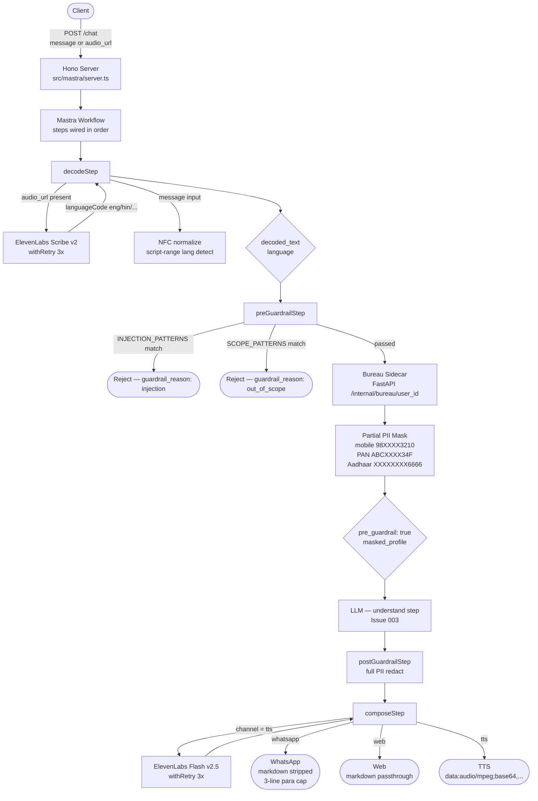
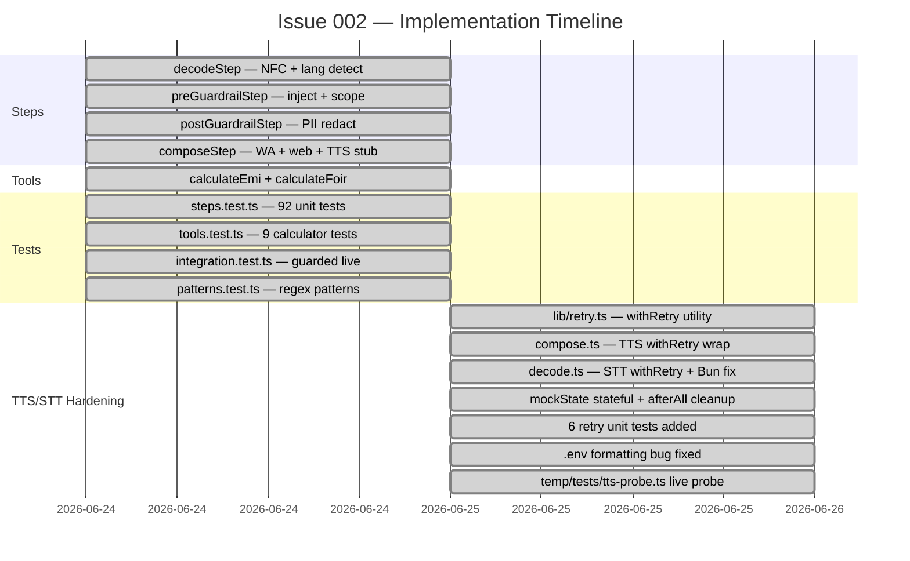
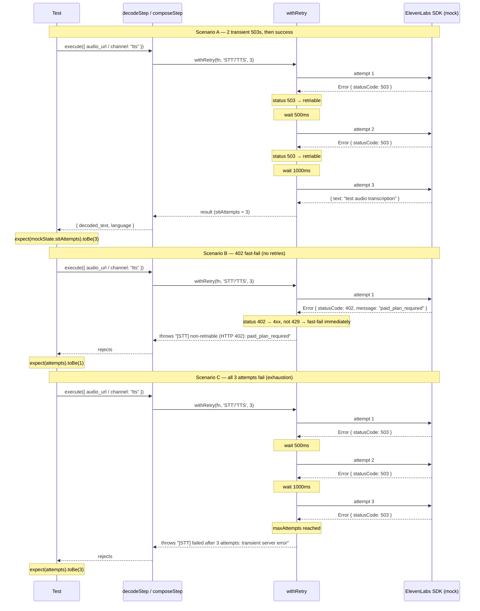
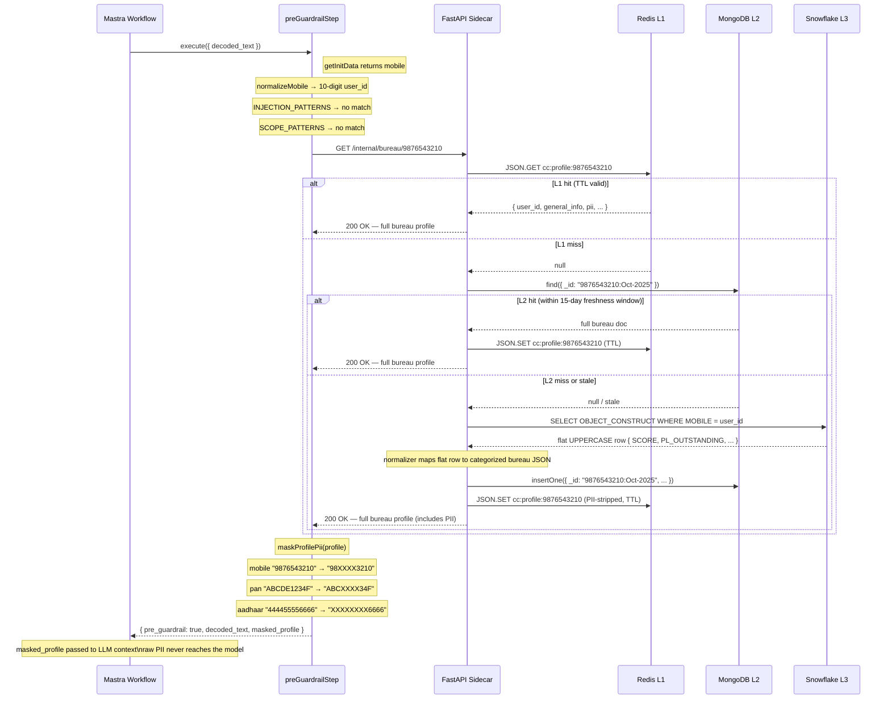

# Issue 002 — Deterministic Steps, Tools & TTS/STT Hardening

**PR:** `dev → main`
**Branch:** `dev`
**Date:** 2026-06-25
**Author:** Suraj Harlekar
**Commits:** `8c8c7ae` → `0c26ab1`
**Test result:** 98 pass · 9 skip · 0 fail

---

## Overview

Issue 002 implements the full Mastra TypeScript pipeline layer for Credix AI — a credit intelligence assistant for Indian users. It delivers four deterministic workflow steps (`decode`, `pre-guardrail`, `post-guardrail`, `compose`), two financial calculator tools, a shared retry utility, and a 98-test suite covering unit, integration, and retry scenarios.

The TTS/STT hardening phase (second half of the issue) wraps both ElevenLabs calls with `withRetry`, fixes a Bun runtime incompatibility with the ElevenLabs SDK's file upload path, resolves a `.env` formatting bug that corrupted the API key, and adds 6 targeted retry tests.

---

## Deliverables

| File | Type | Description |
|------|------|-------------|
| `src/mastra/steps/decode.ts` | Step | NFC normalization, script-based language detection, ElevenLabs STT with retry |
| `src/mastra/steps/pre-guardrail.ts` | Step | Injection/scope filter, bureau sidecar fetch, partial PII masking |
| `src/mastra/steps/post-guardrail.ts` | Step | PII redaction — scrub order Aadhaar → PAN → mobile, lastIndex-safe |
| `src/mastra/steps/compose.ts` | Step | Channel formatter — WhatsApp, web passthrough, TTS (ElevenLabs) with retry |
| `src/mastra/lib/retry.ts` | Lib | `withRetry<T>(fn, label, maxAttempts=3)` — exponential backoff, fast-fail 4xx |
| `src/mastra/tools/calculators.ts` | Tool | `calculateEmi` + `calculateFoir` |
| `src/mastra/__tests__/steps.test.ts` | Test | Unit + retry tests — 98 pass, 9 skip |
| `src/mastra/__tests__/tools.test.ts` | Test | EMI and FOIR calculator correctness |
| `src/mastra/__tests__/integration.test.ts` | Test | Live ElevenLabs + Bureau tests (guarded by env flags) |
| `src/mastra/__tests__/patterns.test.ts` | Test | Pattern matching — injection and PII regex |
| `temp/tests/tts-probe.ts` | Probe | Live end-to-end TTS + STT probe with 5 named sections |
| `.env` | Config | Fixed key/voice on separate lines (were on one line) |

---

## Pipeline Architecture



---

## Implementation Gantt



---

## Sequence Diagram 1 — STT/TTS Retry Tests

Shows the three tested retry scenarios for both STT (decodeStep) and TTS (composeStep).



---

## Sequence Diagram 2 — Pre-Guardrail Data Layer

Shows the bureau fetch through the read-through resolver and how `masked_profile` is constructed and passed downstream.



---

## Error Handling & Try/Catch Strategy

### `withRetry` — shared utility (`src/mastra/lib/retry.ts`)

```
withRetry<T>(fn, label, maxAttempts = 3)
  attempt 1..maxAttempts:
    try:
      return await fn()
    catch err:
      status = err.statusCode ?? err.status
      if status in [400–499] AND status != 429:
        throw immediately — "[label] non-retriable (HTTP status): message"
      if attempt < maxAttempts:
        warn + sleep(500 * attempt)   ← 500ms, 1000ms
  throw — "[label] failed after N attempts: message"
```

| HTTP status | Action | Reason |
|---|---|---|
| 5xx | Retry | Transient server error |
| 429 | Retry | Rate limit — back off and retry |
| 402 | Fast-fail | Billing/plan issue — retrying is futile |
| 401, 403 | Fast-fail | Auth/permission — retrying won't help |
| 400 | Fast-fail | Bad request — caller must fix input |
| Network error (no status) | Retry | Connection drop may be transient |

### Per-step error handling

| Step | Where | Strategy | Notes |
|---|---|---|---|
| `decodeStep` | STT call | `withRetry(..., 'STT')` | Bun-safe Buffer upload for local files |
| `decodeStep` | missing key | throw before retry | `ELEVENLABS_API_KEY` guard — immediate fail |
| `composeStep` | TTS call | `withRetry(..., 'TTS')` | Empty stream → `err.statusCode = 500` → triggers retry |
| `preGuardrailStep` | bureau fetch | `try { ... } catch {}` | **Silent swallow** — bureau fetch is non-blocking; guardrail purpose is filtering, not identity. Missing profile → `masked_profile = undefined`, workflow continues |
| `postGuardrailStep` | PII redact | no throws | Pure string transform; cannot fail |
| `composeStep` (WA/web) | channel format | no throws | Pure string transform; cannot fail |

### Why pre-guardrail swallows bureau errors silently

The guardrail step's primary job is to block injection and out-of-scope queries. The bureau fetch is best-effort context enrichment for the downstream LLM. A sidecar timeout or network hiccup must not block a valid user query — the LLM can still respond without the profile. The error is intentionally not logged to avoid leaking user IDs to stdout.

---

## Bugs Fixed

| # | Bug | Root Cause | Fix |
|---|---|---|---|
| 1 | `.env` API key corrupted | `ELEVENLABS_API_KEY` and `ELEVENLABS_VOICE_ID` on one line — Bun parsed the entire line as the key value (`sk_...TRnaQb7q41oL7sV0w6Bu`) | Split onto two separate lines in `.env` |
| 2 | STT `createReadStream` fails in Bun | ElevenLabs SDK detects `RUNTIME.type === "bun"` and skips the Node.js `Readable` branch; `createReadStream` result is not a `ReadableStream` and is rejected as "Unsupported stream type: object" | `readFileSync` → `Buffer` + `WithMetadata { data, contentType, filename }` — SDK's `isBuffer` path works in both runtimes |
| 3 | Global `/g` regex `lastIndex` silent miss | Exported regex constants with the `g` flag retain `lastIndex` between calls; second call to `.replace()` starts mid-string and misses matches | `new RegExp(pattern.source, 'g')` constructed per call in `postGuardrailStep` |
| 4 | `mockState` bleed across test files | `mock.module` and `global.fetch` are shared for the entire `bun test` run; retry tests set `ttsFailUntilAttempt = 99`, leaving integration tests with a permanently failing TTS mock | `afterAll` in `steps.test.ts` resets all mockState fields and restores `global.fetch = originalFetch` |
| 5 | Integration TTS tests ran with mock | `mock.module` is global — integration tests received the mock's 16-byte buffer (24 chars base64) and passed length checks incorrectly | `hasElevenLabs` now requires `sk_` prefix; mock context uses `test-key` so integration tests skip automatically |
| 6 | Bureau integration tests auto-ran | `.env` has sidecar config but sidecar not started → `fetch` throws → `masked_profile = undefined` → test fails on `toBeDefined()` | `hasBureau` requires explicit `BUREAU_LIVE=true` flag in addition to the URL/secret env vars |
| 7 | Simran voice 402 not retried | `TRnaQb7q41oL7sV0w6Bu` (Simran) is a paid ElevenLabs library voice — throws HTTP 402 | `withRetry` correctly fast-fails on 402. Fix: use `JBFqnCBsd6RMkjVDRZzb` (George, free tier) in `ELEVENLABS_VOICE_ID` |

---

## Test Results

```
bun test src/mastra/__tests__

 steps.test.ts      ████████████████████ 86 pass  9 skip
 tools.test.ts      ████████████████████  9 pass
 patterns.test.ts   ████████████████████  3 pass

 Total: 98 pass · 9 skip · 0 fail
```

### What the 9 skips are

| Count | Guard | Condition to un-skip |
|---|---|---|
| 3 | `it.skipIf(!hasElevenLabs)` | `ELEVENLABS_API_KEY` starts with `sk_` (real key, not mock `test-key`) |
| 2 | `it.skipIf(!hasElevenLabs \|\| !hasAudioUrl)` | Real key + `TEST_AUDIO_URL` set |
| 4 | `it.skipIf(!hasBureau)` | `BUREAU_LIVE=true` + `BUREAU_SIDECAR_URL` + `INTERNAL_API_SECRET` + `TEST_MOBILE` |

### Live probe confirmation (run manually)

```
[1] Voices — George (JBFqnCBsd6RMkjVDRZzb) found in account
[2] TTS happy path — PASS (using George voice, free tier)
[3] TTS retry simulation — succeeded on attempt 3 after 2 simulated 503s
[4] TTS fast-fail — PASS — threw after 1 attempt (402), did not retry
[5] STT local file — PASS
    language: en (raw: eng)
    text: "How is my credit history? Please check out my complete profile and give a overview."
```

---

## Outstanding (Issue 004)

- `src/mastra/tools/eligibility.ts` — credit card eligibility decision tree (blocked on workflow wiring; `identityCheckStep` does not provide `bureau_profile` directly — bureau data comes via `getBureauProfile` tool)
- `ELEVENLABS_VOICE_ID` — set to `JBFqnCBsd6RMkjVDRZzb` (George) for free tier; upgrade to paid plan to use Simran (`TRnaQb7q41oL7sV0w6Bu`) or another library voice
- `memory-writeback.ts` — currently a no-op skeleton; full persistence logic pending Issue 004
